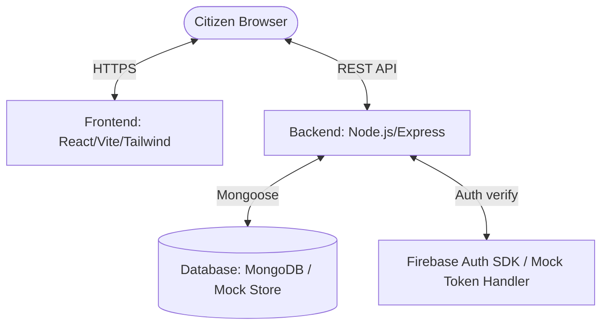

# GreenSteps India — Full Project Report & Submission Document

**GreenSteps India** is a modern web platform designed to empower Indian citizens to calculate, track, and reduce their carbon footprint through gamification, local benchmark comparisons, and incentives.

---

## 1. Executive Summary
- **Aligned Problem Statement**: Combat climate change by democratizing carbon footprint awareness, education, and actionable sustainability tracking.
- **Key Solution**: An interactive dashboard, a multi-step carbon calculator using Indian emission factors, a rewards-based activity log, local state recommendations, and gamified challenges.
- **Ideal For**: Hackathons, ideathons, and municipal/state governance programs aiming to foster environmental responsibility.

---

## 2. Technical Stack & Architecture

- **Frontend**:
  - **Framework**: React 18 (Vite-powered SPA)
  - **Styling**: Tailwind CSS + Custom Brand Theme (Eco-Greens)
  - **Visualizations**: Recharts (Pie Chart and Area Charts)
  - **Mapping**: React Leaflet (OpenStreetMap integration for Indian State statistics)
- **Backend**:
  - **Runtime**: Node.js + Express API
  - **ORM**: Mongoose / MongoDB
  - **Authentication**: Firebase Admin SDK with a fully functioning fallback **offline mock mode** to run local development/testing without live Firebase/MongoDB.
- **Deployment**:
  - Multi-stage Dockerfiles + Nginx SPA routing.
  - Google Cloud Platform (GCP) Cloud Run services.

---

## 3. Mathematical Emission Models (Indian Benchmarks)

The application calculates emissions based on localized statistics from the **Central Electricity Authority (CEA)** and the **Ministry of New and Renewable Energy (MNRE)**:

| Category | Unit | Emission Factor (kg CO₂) | Details / Source |
| :--- | :--- | :--- | :--- |
| **Electricity** | per kWh | 0.82 | High emission factor due to coal-dominated grid |
| **LPG Cooking Gas** | per Cylinder | 42.3 | Standard 14.2 kg domestic LPG cylinder |
| **Petrol Car** | per km | 0.18 | Single-occupancy transit average |
| **Diesel Car** | per km | 0.14 | Direct combustion average |
| **Two-Wheeler** | per km | 0.06 | Motorbikes/scooters |
| **Electric Vehicle (EV)** | per km | 0.04 | Accounted for indirect grid charging |
| **Metro / Train** | per km | 0.015 | Mass electric transit efficiency |
| **High-Meat Diet** | per day | 2.5 | Heavy animal protein footprint |
| **Vegetarian Diet** | per day | 1.2 | Dairy, pulses, grains |
| **Vegan Diet** | per day | 0.7 | Fully plant-based footprint |
| **Shopping** | per item | 0.5 | Manufacturing & shipping general estimate |
| **Mixed Waste** | per kg | 0.6 | Landfill methane conversion |
| **Dry Recycling** | per kg | 0.1 | Sorting & processing footprint |

---

## 4. Platform Features
1. **Interactive Dashboard**: Real-time rotating eco tips, annual carbon counters, national benchmark checks (Indian average: 2,500 kg/year), and points ledger.
2. **Multi-Step Calculator**: Slides and fields to estimate monthly/annual footprints across transportation, power, diet, shopping, and waste.
3. **Log Tracker**: Daily check-in sheet to record eco-activities. Users earn Green Points (base 10 pts, with 25 pts bonuses for green transits, recycling, or vegan meals).
4. **Gamification & Badges**: Milestone badge unlock rules (e.g. *Eco Champ* badge unlocks when points exceed 200).
5. **Interactive Carbon Map**: An Leaflet map of India highlighting regional statistics and recommendations.

---

## 5. Recent Improvements & Polish

To elevate the submission quality and address hackathon requirements, the following updates were added:

### A. Testing Suite (30 Tests)
- **Backend Tests (Jest + Supertest)**: Added 11 API integration tests covering:
  - Carbon Calculation POST `/api/v1/carbon/calculate`
  - Activity Logging `/api/v1/activities` (scoring, validation, rewards points logic)
  - Auth Profile synchronization GET `/api/v1/auth/me`
  - Profile Update PUT `/api/v1/users/profile`
- **Frontend Tests (Vitest + React Testing Library + JSDOM)**: Added 19 unit & component tests covering:
  - `carbonCalculator.js` math models
  - Login/Register form rendering, input validation, and submission mocking
  - Multi-step CalculatorView wizard progress and validation

### B. Accessibility (WCAG 2.1 Compliance)
- Mapped all input and select controls to their labels using `htmlFor` and unique `id` properties.
- Added descriptive `aria-label` properties to icon-only buttons (mobile menu toggler, category selector pills, Google Sign-in button).
- Added `lang="en"` attribute to root HTML.

### C. Performance & Efficiency
- **React Lazy Loading**: Added `React.lazy` and `React.Suspense` for routers to split bundles and minimize initial loading assets.
- **Log Pagination**: Implemented backward-compatible paginated queries (`page` and `limit` parameters) in backend API routes and integrated Prev/Next buttons on the TrackerView table, optimizing response size for long-term usage.

### D. CI/CD Pipeline Integration
- Integrated automated tests run (`npm test` and `npm run test`) inside the GitHub Actions workflow (`deploy.yml`) before the container compilation and deployment steps.

---

## 6. Live Deployment Details (GCP Cloud Run)

Both services are live in the **asia-south1** region (Mumbai, India) for minimal latency:

- **Frontend Application URL**: [https://greensteps-web-736652973920.asia-south1.run.app](https://greensteps-web-736652973920.asia-south1.run.app)
- **Backend API Service URL**: [https://greensteps-api-736652973920.asia-south1.run.app](https://greensteps-api-736652973920.asia-south1.run.app)
